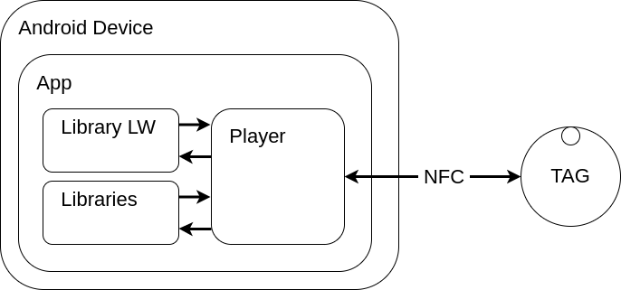
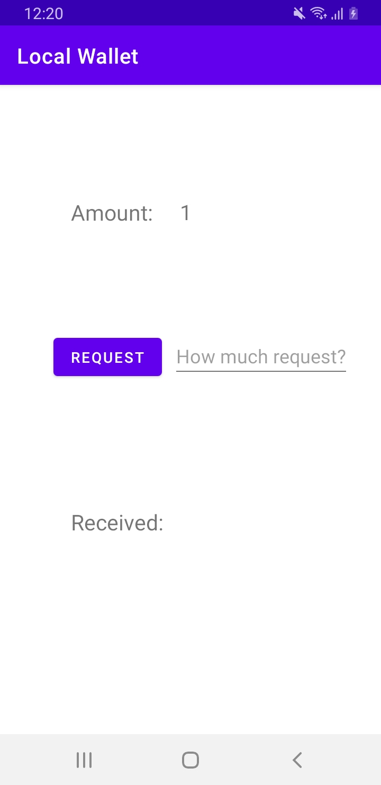
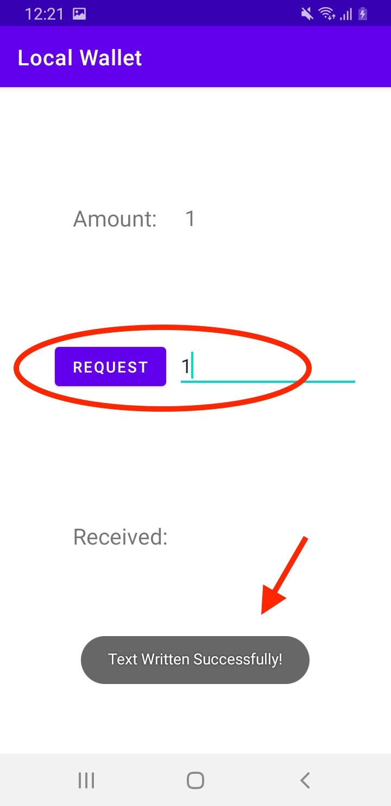
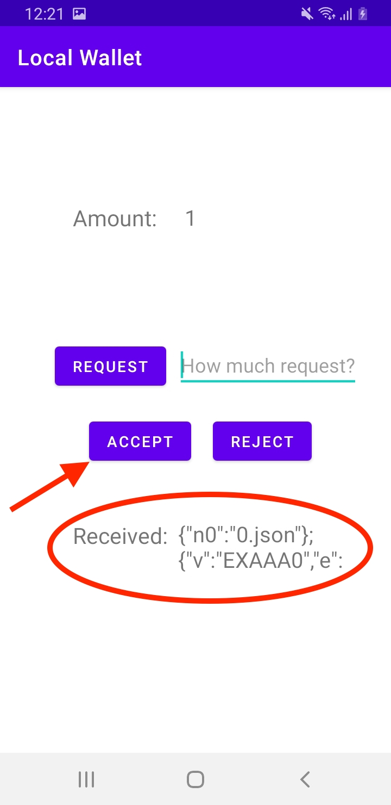
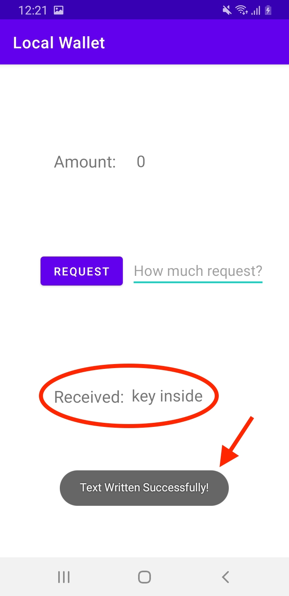
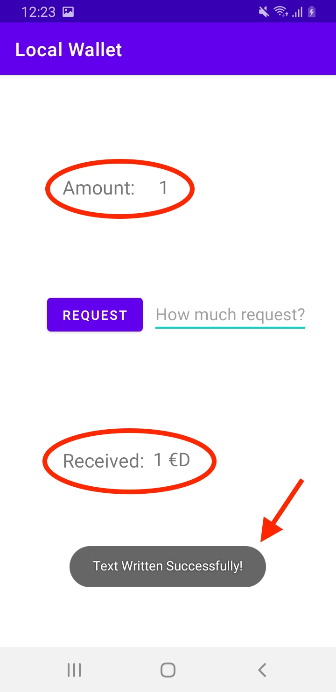

<div align="center">
    <a href="https://www.unisalento.it">
        
    </a>
</div>

> Deposito offline di valuta digitale su tag NFC un caso d uso per la smart city

## Come funziona?

Si ha un dialogo tra l'applicativo e le librerie implementate (per poter avere più **atomicità** e quindi sicurezza), ed il Tag NFC per effettuare lo **scambio di denaro**.


Obiettivi raggiunti:

- creazione di un applicativo per la **trasmissione di Token** tra 2 attori tramite Tag NFC
- **preparazione** dell’applicativo per la futura implementazione del si- stema operativo (OS) Trusty
- permettere uno **scambio di valuta offline** e in sicurezza tramite l’utilizzo di Tag NFC che garantisce **l’autenticità dei Token**
- gestire la problematica del **double spending** grazie all’atomicità dei metodi della **libreria personalizzata** e la loro rispettiva chiamata data dal trigger di scrittura/lettura del Tag NFC

<div align="center">
    
</div>


## Struttura files

- json exchange:
    ```json
    {"v":"EXAAA0","e":"0"}

        └──── 📁 exchanges
           ├──── 📁 0
           ⎪  └──── 📄 0.json
           ├──── 📁 1
           ⎪  └──── 📄 1.json
           └──── ...
    ```

- json numberOf:
    ```json
    {"n0":"0.json","n1":"1.json","n2":"2.json"}

        └──── 📁 numberOf
           └──── 📄 nexchange.json
    ```

- json sandboxes:
    ```json
    {"v":"AAAAA0","t":"t0","k":""}

        └──── 📁 sandboxes
           ├──── 📁 0
           ⎪  └──── 📄 0.json
           ├──── 📁 1
           ⎪  └──── 📄 1.json
           └──── ...
    ```

## App Screenshots

| 1. App appena avviata | 2. Richiesta Token (avvicinamento Tag NFC) | 3. Richiesta ricevuta |
| :---: | :---: | :---: |
|  |  |  |

---

| 4. Richiesta accettata (avvicinamento Tag NFC) | 5. Scrittura Token | 6. Token accettato (avvicinamento Tag NFC) |
| :---: | :---: | :---: |
|  |  |  |